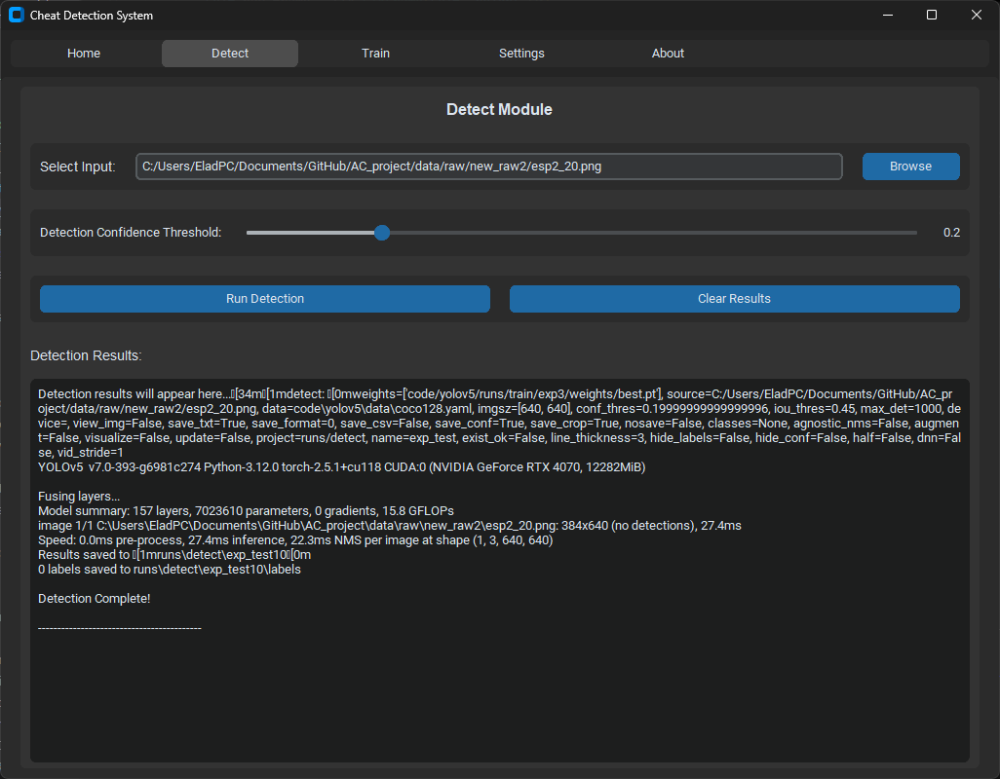

# Portfolio – Elad Ozery

Final-year Software Engineering student at Azrieli College of Engineering. Passionate about system programming, backend development, and working with languages like C++ and Python. Seeking an entry-level position where I can grow professionally and contribute meaningfully to a development team.

---

## Projects

### Itim Website
A responsive, multi-page website developed by a student team as part of a real-world collaboration with the Itim Association. The site helps users locate mikvaot across Israel using an interactive map and advanced search filters.

- My Role: Responsible for backend Python scripting to process and clean data about mikvaot (locations, accessibility, contact info), as well as contributing to the site’s frontend and integration with the Google Maps API.
- Technologies: Python, React, Firebase, Google Maps API 
- GitHub: https://github.com/EladOzery/Itim_project

---

### AI-based Anti-Cheat System (Final Project)
A standalone desktop application designed to detect cheating behavior in video game footage using computer vision and object detection. The system analyzes gameplay frames to identify visual anomalies such as ESP overlays, using YOLOv5 and a custom detection pipeline.

- Technologies: Python, YOLOv5, OpenCV, CustomTkinter
- Features: Real-time detection, image/video support, live GUI preview, modular structure
- GitHub: Private (available upon request)

---

### MoviesFinderApp
A C++ desktop application for searching movies using the OMDB API. Features a modern graphical interface using ImGui and displays movie posters.

- Technologies: C++, ImGui, OMDB API
- GitHub: https://github.com/EladOzery/MoviesFinderApp

---

### HTTP Proxy – Server Side
A multithreaded HTTP proxy server built in C that validates, filters, and forwards requests based on predefined rules. Handles concurrent client connections with POSIX threads.

- Technologies: C, POSIX Threads, Sockets
- GitHub: https://github.com/EladOzery/HTTPProxyServerSide

---

### HTTP Proxy – Client Side
A basic HTTP proxy client implemented in C. Handles URL requests, connects to servers, and saves received content locally. Developed as part of a networking course.

- Technologies: C, Sockets
- GitHub: https://github.com/EladOzery/HTTPProxyClientSide

---

### Event Driven Chat Server
A chat server simulator that supports multiple concurrent client connections using the `select` system call. Demonstrates event-driven architecture for handling I/O without multi-threading.

- Technologies: C, Sockets, select()
- GitHub: https://github.com/EladOzery/EventDrivenChatServer

---

## About Me
- Software Engineering student at Azrieli College of Engineering
- Interested in system-level programming, backend development, and computer networking
- Skilled in C, C++, Python, socket programming, multi-threading, and web technologies

---

## Contact
- GitHub: https://github.com/EladOzery
- Email: eladozery2@gmail.com
